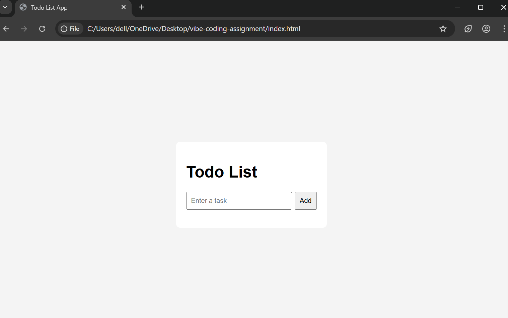

# Todo List Web Application (Vibe Coding Project)

A simple and functional Todo List web application built using a vibe coding tool.  
This project demonstrates how agent-based AI development tools can accelerate the software development process while maintaining clean and readable code.

---

## 📸 Screenshot / Demo

(Add a screenshot or GIF of your working project here)

Example:


---

## 🚀 Features

- Add new tasks
- Edit existing tasks
- Delete tasks
- Mark tasks as completed
- Persistent storage using browser localStorage

---

## 🛠 Technologies Used

- HTML5
- CSS3
- JavaScript (ES6)
- Browser Local Storage

---

## 🤖 Vibe Coding Tool Used

- **Replit Agent** – AI-powered agent used to scaffold, generate, and refine the application logic and structure.

---

## 📦 Installation / Setup Instructions

1. Clone the repository:
   ```bash
   git clone https://github.com/your-username/vibe-coding-assignment.git
